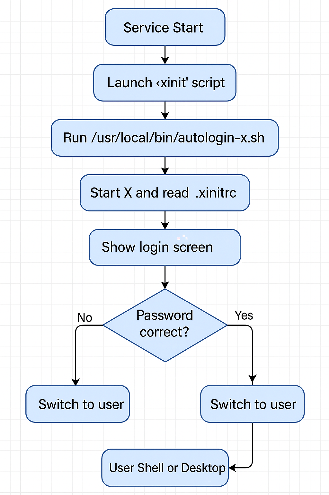
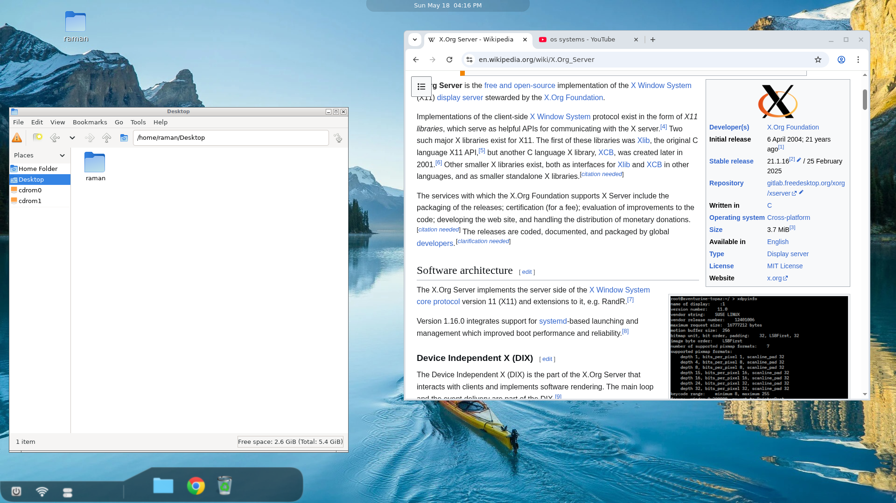
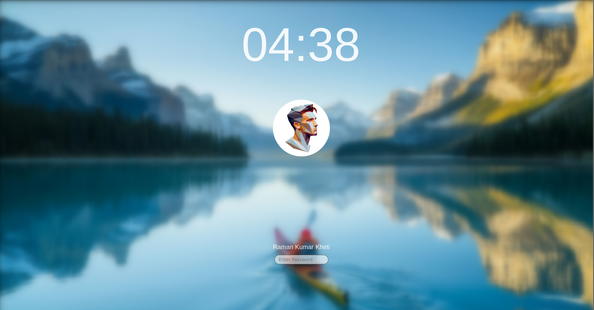

# 🛠 Debian-Based OS with GUI 




This project is a custom Debian-based operating system built using 

## 🧼 Clean Build Environment
If changes any config files
```bash
sudo lb config
```

Before rebuilding:

```bash
sudo lb clean
```

To clean everything:
```bash
sudo lb clean --purge
```

---

## 🏗 Build the ISO

```bash
sudo lb build
```

Generated ISO will be located in the project root directory.

---

## 📋 Notes

- No use of `sudo` inside scripts or setup (OS-level configuration).
- GUI login screen is purely custom and replaces default `getty`.

- No static users created — system dynamically handles user detection.
- Use `.xinitrc` under `/etc/skel` to prepopulate new user configs.


## Operating System Screenshots



